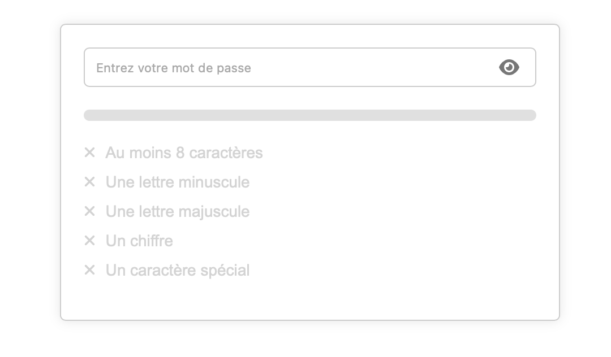

# Password-Checker

Le Password Checker est une application web qui permet aux utilisateurs de vérifier la robustesse de leurs mots de passe. Il valide le mot de passe en fonction de plusieurs critères de sécurité et affiche visuellement la progression de la validité grâce à une barre de progression colorée. Lorsque tous les critères sont satisfaits, une animation festive de confettis est déclenchée pour récompenser l'utilisateur.

## Fonctionnalités

- **Validation du mot de passe** :
  - Au moins 8 caractères
  - Contient au moins une lettre minuscule
  - Contient au moins une lettre majuscule
  - Contient au moins un chiffre
  - Contient au moins un caractère spécial

- **Indicateur de progression** : Une barre de progression montre visuellement combien de critères sont actuellement satisfaits. La couleur de la barre varie de rouge à vert en fonction de la validité du mot de passe.

- **Affichage/Masquage du mot de passe** : Les utilisateurs peuvent choisir d'afficher ou de masquer leur mot de passe à l'aide d'une icône.

- **Animation des confettis** : Une fois que tous les critères sont satisfaits, une animation de confettis est déclenchée pour offrir une rétroaction positive à l'utilisateur.

## Comment utiliser

1. Ouvrez le fichier `index.html` dans votre navigateur.
2. Entrez votre mot de passe dans le champ de saisie.
3. Observez la progression de la validation et ajustez votre mot de passe en fonction des critères suggérés.
4. Une fois que tous les critères sont satisfaits, profitez de l'animation des confettis!

## Personnalisation

- Modifiez le fichier `styles.css` pour adapter le design à vos préférences ou à l'identité visuelle de votre marque.
- Si vous souhaitez ajouter ou modifier les critères de validation du mot de passe, modifiez le script dans `main.js`.
- Pour ajouter ou ajuster les animations et interactions, modifiez le fichier `main.js` et ajoutez les bibliothèques nécessaires si besoin.

## Contribuer

Les contributions sont toujours les bienvenues ! Si vous avez des suggestions d'améliorations ou souhaitez ajouter des fonctionnalités supplémentaires à cette navbar, n'hésitez pas à soumettre une demande de tirage (pull request) ou à ouvrir une issue.